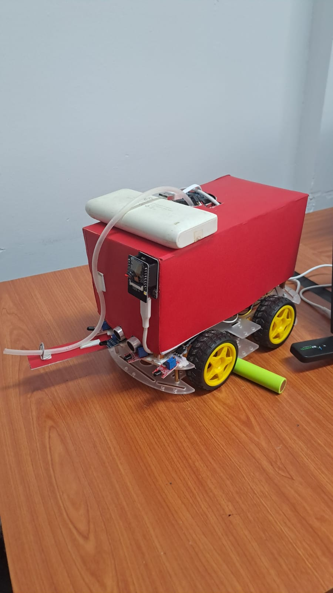

# Advanced control system for fire detection and extinguishing robot



This document describes how to wire an L298N / L293D motor driver to an ESP32, the functions of each relevant pin on the driver, and example ESP32 code (Arduino API) to control two DC motors (left and[...]

---

## Wiring / Pin mapping

Below are compact tables showing the connections between the motor driver, the ESP32, the motors and the power supply. Use these to quickly match wires.

Motor driver pins -> ESP32
| Motor Driver Pin | Function / Purpose                 | ESP32 Pin | Notes |
| --- | --- | ---: | --- |
| ENA | Speed control for Motor A (PWM input) | 13 | Use LEDC PWM channel on ESP32 |
| IN1 | Direction input Motor A (IN1)        | 14 | Digital output |
| IN2 | Direction input Motor A (IN2)        | 15 | Digital output |
| IN3 | Direction input Motor B (IN3)        | 18 | Digital output |
| IN4 | Direction input Motor B (IN4)        | 19 | Digital output |
| ENB | Speed control for Motor B (PWM input) | 12 | Use LEDC PWM channel on ESP32 |
| OUT1 | Motor A + output (driver -> motor)   | — | Connect to Motor A+ |
| OUT2 | Motor A - output (driver -> motor)   | — | Connect to Motor A- |
| OUT3 | Motor B + output (driver -> motor)   | — | Connect to Motor B+ |
| OUT4 | Motor B - output (driver -> motor)   | — | Connect to Motor B- |

Motor connections
| Motor | Driver output (+) | Driver output (-) |
| --- | ---: | ---: |
| Motor A (Left)  | OUT1 | OUT2 |
| Motor B (Right) | OUT3 | OUT4 |

Power connections
| Supply / Signal | Connect to | Notes / Warnings |
| --- | --- | --- |
| 12V battery positive | Motor driver 12V input (VMS / +12V) | Provides motor supply — ensure battery can supply stall current |
| 12V battery negative | Motor driver GND | Common ground with ESP32 and battery negative |
| Motor driver GND | ESP32 GND | All grounds must be common |
| Motor driver 5V output (if present) | ESP32 Vin (optional) | Fit regulator jumper on many L298N boards only if you want driver to power ESP32 and regulator is stable; otherwise use a separate 5V regulator for ESP32 |
| (Optional) Fuse / current-limiter | In series with 12V positive | Recommended for safety |

Note: Many L298N boards include a jumper to connect the motor-driver's on-board 5V regulator to the 5V output pin. Fit that jumper only if you want the driver to power the ESP32 and the regulator is rated for the load; otherwise supply the ESP32 from a separate 5V regulator or USB.

---

## Pin functions and how to use them

- ENA / ENB (Enable A / Enable B):
  - These pins control the speed of Motor A and Motor B.
  - They accept a PWM signal to vary motor speed. With no PWM and ENx HIGH, the motor runs at full speed (depending on IN pins).
  - On the ESP32 use a LEDC PWM channel (or other PWM facility) on the pins connected to ENA/ENB and change duty cycle to control speed.

- IN1 / IN2 (Motor A direction inputs):
  - Digital inputs that determine rotation direction for Motor A.
  - Typical truth table:
    - IN1 HIGH, IN2 LOW  → Motor A forward
    - IN1 LOW, IN2 HIGH  → Motor A backward
    - IN1 LOW, IN2 LOW   → Motor A coast/stop (driver-dependent)
    - IN1 HIGH, IN2 HIGH → Motor A brake (driver-dependent)

- IN3 / IN4 (Motor B direction inputs):
  - Same as IN1/IN2 but for Motor B.

- OUT1 / OUT2 / OUT3 / OUT4:
  - These are the motor outputs from the driver — wire your motors to these.

- Power (12V input):
  - The motors' supply. Make sure the battery/supply can provide the stall current of your motors.
  - The motor driver dissipates heat; provide adequate cooling or choose higher-current drivers if necessary.

Differences between L298N and L293D:
- L298N is a discrete bipolar H-bridge IC and typically can supply higher currents but runs hotter (needs heat sink).
- L293D is similar but often in a smaller DIP package and limited current capability.
- Pin usage is the same for simple projects, but check datasheets and board-specific wiring (e.g., pin labels) before connecting.

Safety & best practice:
- Use flyback diodes if your driver board doesn't include them.
- Place a fuse or current-limiting protection between battery and driver for safety.
- Test first without motors connected when verifying directions.
- Ensure all grounds are common.

---

## Example: ESP32 (Arduino core) code

This example uses LEDC PWM on the ESP32 to control motor speed via ENA/ENB and digital outputs for IN pins to set direction. PWM values use 8-bit resolution (0-255). Adjust PWM frequency and resolutio[...]

```cpp
// ESP32 pin definitions
const int ENA = 13; // PWM pin for Motor A speed (connect to ENA)
const int IN1 = 14;
const int IN2 = 15;

const int ENB = 12; // PWM pin for Motor B speed (connect to ENB)
const int IN3 = 18;
const int IN4 = 19;

// LEDC channels and settings
const int CHANNEL_A = 0;
const int CHANNEL_B = 1;
const int PWM_FREQ = 20000; // 20 kHz
const int PWM_RESOLUTION = 8; // 8-bit (0..255)

// Helper: constrain a signed -255..255 speed to 0..255 PWM
int pwmForSpeed(int s) {
  int v = abs(s);
  if (v > 255) v = 255;
  return v;
}

void setup() {
  // Direction pins
  pinMode(IN1, OUTPUT);
  pinMode(IN2, OUTPUT);
  pinMode(IN3, OUTPUT);
  pinMode(IN4, OUTPUT);

  // Setup LEDC PWM channels
  ledcSetup(CHANNEL_A, PWM_FREQ, PWM_RESOLUTION);
  ledcAttachPin(ENA, CHANNEL_A);

  ledcSetup(CHANNEL_B, PWM_FREQ, PWM_RESOLUTION);
  ledcAttachPin(ENB, CHANNEL_B);

  // Ensure motors are stopped at boot
  stopMotors();
}

void setMotorA(int speed) { // speed range: -255 .. 255
  if (speed > 0) {
    digitalWrite(IN1, HIGH);
    digitalWrite(IN2, LOW);
    ledcWrite(CHANNEL_A, pwmForSpeed(speed));
  } else if (speed < 0) {
    digitalWrite(IN1, LOW);
    digitalWrite(IN2, HIGH);
    ledcWrite(CHANNEL_A, pwmForSpeed(speed));
  } else {
    // Stop / coast
    digitalWrite(IN1, LOW);
    digitalWrite(IN2, LOW);
    ledcWrite(CHANNEL_A, 0);
  }
}

void setMotorB(int speed) { // speed range: -255 .. 255
  if (speed > 0) {
    digitalWrite(IN3, HIGH);
    digitalWrite(IN4, LOW);
    ledcWrite(CHANNEL_B, pwmForSpeed(speed));
  } else if (speed < 0) {
    digitalWrite(IN3, LOW);
    digitalWrite(IN4, HIGH);
    ledcWrite(CHANNEL_B, pwmForSpeed(speed));
  } else {
    digitalWrite(IN3, LOW);
    digitalWrite(IN4, LOW);
    ledcWrite(CHANNEL_B, 0);
  }
}

void stopMotors() {
  setMotorA(0);
  setMotorB(0);
}

void loop() {
  // Drive forward half speed
  setMotorA(150);
  setMotorB(150);
  delay(2000);

  // Stop
  stopMotors();
  delay(1000);

  // Turn in place: left backward, right forward
  setMotorA(-150);
  setMotorB(150);
  delay(1200);

  stopMotors();
  delay(2000);
}
```

Notes about the example:
- If motors spin in the opposite direction to what you expect, invert the sign convention in setMotor functions or swap the motor wires (A+/A-) or (B+/B-).
- The ESP32 PWM range and API allow many resolution/frequency choices. Use a frequency that is inaudible for your motors (several kHz to tens of kHz).
- Some cheap L298N modules invert PWM or tie EN pins differently—verify behavior on your board.

---

## Advanced suggestions

- Replace L298N/L293D with a modern MOSFET-based H-bridge (DRV8833, VNH3SP30, BTS7960, etc.) if your motors draw high current or you want higher efficiency and less heat.
- Implement soft start / acceleration profiles in code to avoid large inrush currents.
- Add current sensing (shunt + ADC) if you need to monitor motor load / stall conditions.
- Add a hall encoder or rotary encoder to implement closed-loop speed or position control.


